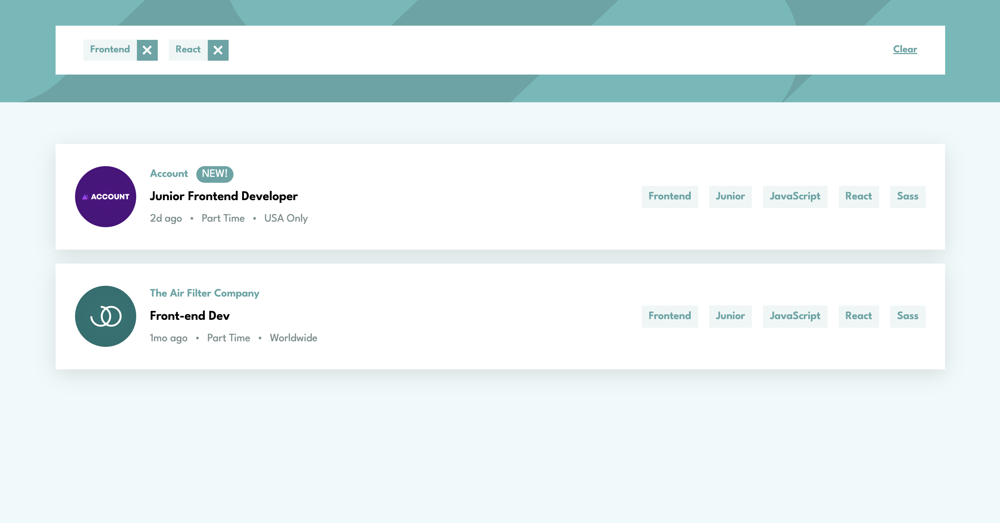

Static Job Listings Master is a dynamic webpage built with React, designed to display a list of job postings with filtering capabilities. It features a responsive design optimized for mobile and desktop, allowing users to filter jobs by role, level, languages, and tools, with data sourced from a local JSON file.

